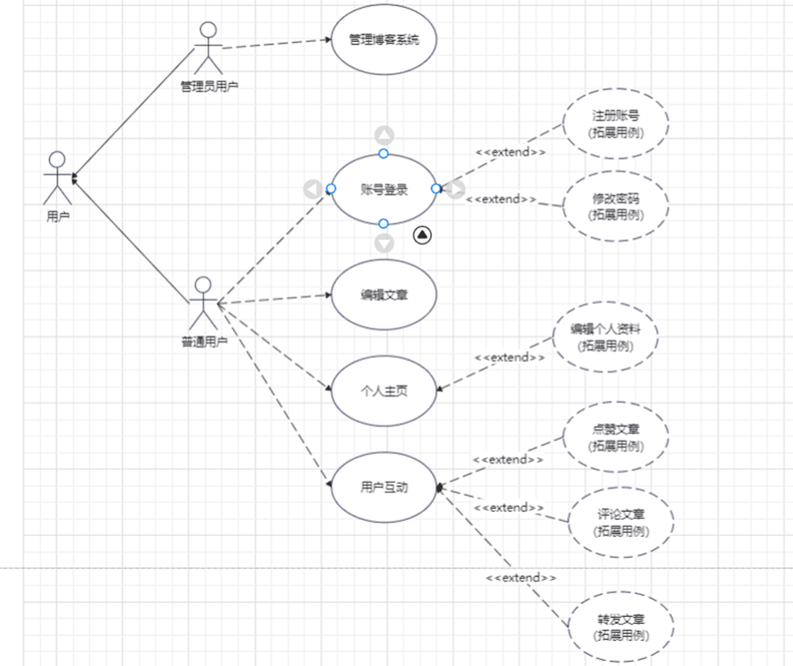
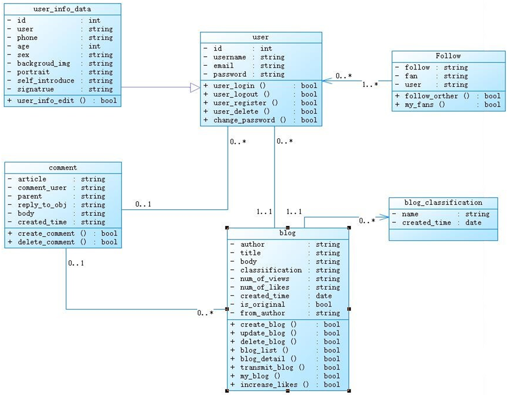
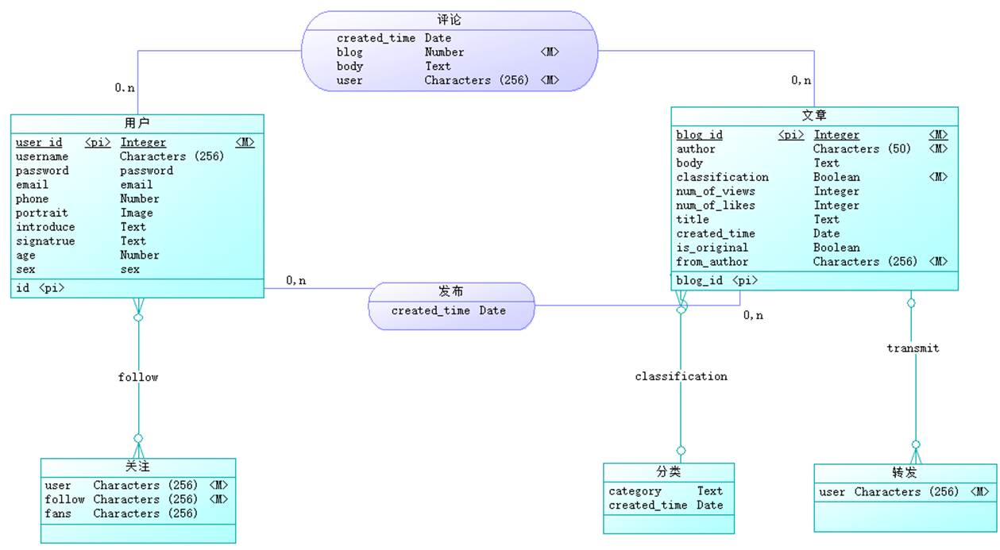
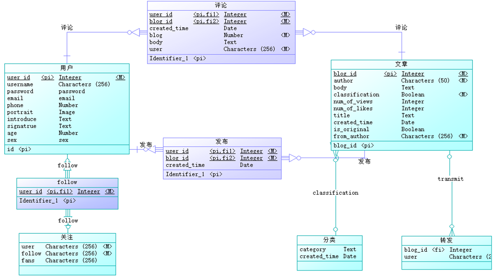

 ### Python课设：web_blog
> 基于django实现的博客社区
### 项目内容
1. 博文管理
2. 用户账户信息管理
3. 评论管理
4. 第三方登录
5. 项目部署
### 技术栈
> 1. 后端：Django
> 2. 前端：html、css、Javascript
> 3. 数据库：MySQL
> 4. 插件：Bootstrap、Jquery、Layer、csrf（用于实现Ajax的csrf验证）
### 主要实现的功能
1. userinfo模块
> 1. 管理员账户
> 2. 注册、注销用户
> 3. 登录账户
> 4. 修改密码
> 5. 找回密码
> 6. 用户资料的编辑与展示

2. blog模块
> 1. 导航栏、搜索框
> 2. 全站导航：文章分类、文章排序
> 3. 文章的发布、修改、删除、搜索、列表展示
> 4. 文章的详情阅读：关注、点赞、转发功能，支持markdown语法、富文本编辑

3. comment模块
> 1. 评论文章：支持markdown语法以及富文本编辑
> 2. 点赞文章
> 3. 转发文章
> 4. 关注功能

### 概要设计：用例图

### 详情设计：类图

### 数据库概要设计：ER图

### 数据库逻辑设计：数据库表

