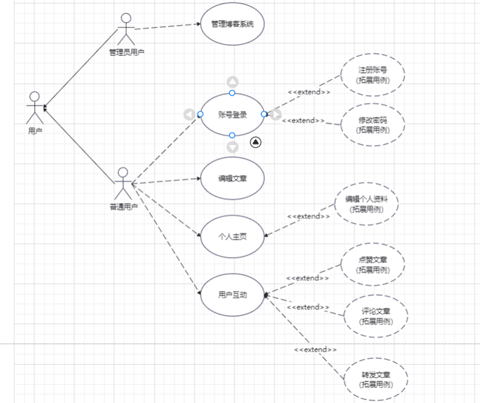
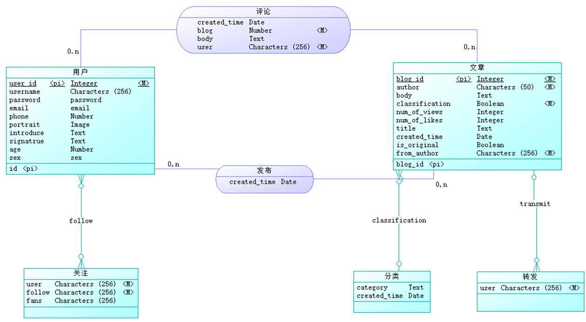
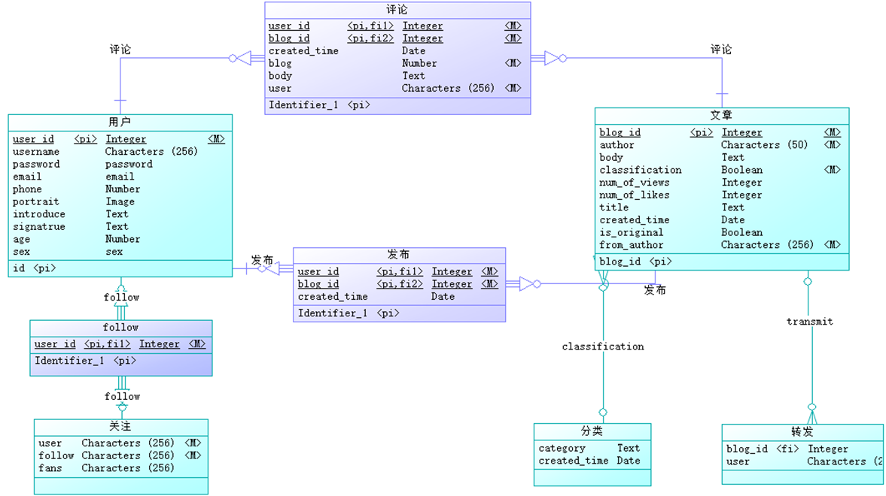

## 顶部导航栏
从左至右依次是文章名称（博客社区）、首页、发布（发布文章）、我的（个人创建的所有文章）、下拉框、搜索栏。
下拉框中包含了个人简介、退出登录、注销账户、修改密码、关注列表、粉丝列表。
右部搜索框实现了根据文章标题或文章内容进行搜索的功能。

当用户未登录时

## 首页
首页右边列出了网站上全部的文章，每个文章都列出了标题、创建时间、文章前一百个字符，右下角还显示了每个文章的浏览量、
点赞量、评论数，以及阅读文章详情的按钮。首页左边是一个全站导航，
可以实现按文章类型筛选出需要的文章

同时还提供了可以快速回到顶部的功能

## 文章详情页
详细列出了一篇文章的标题、创建时间、作者、浏览量、点赞数、评论数，
还提供了关注该作者的功能，关注后可以在直接的关注列表里找到。
点击点赞按钮时点赞数会显示成红色同时点赞数+1，当点赞过后再次点赞时会提示重复点赞，
每个用户对一篇文章只允许点赞一次

为了方便用户关注作者，点击作者名字时会跳转到作者的个人全部文章展示页面。
当访问该文章详情页面的用户是文章作者时，会在文章右部提供修改文章以及删除文章的接口，
而非文章作者则不会出现该功能

在文章的下边还提供了转发功能，转发成功时会出现转发成功的弹窗提示
当该篇文章是转发的文章，还会显示文章的原作者，点击原作者的名字可以跳转到原作者的个人博客

文章最下方提供了评论功能，评论功能还引入了富文本编辑功能
当你是评论原作者时允许用户删除评论

在文章内容显示中我们还支持markdown语法显示

## 发布

支持富文本编辑、支持markdown语法

## 我的
个人全部文章的展示页

## 个人简介页
支持头像更换、设置个性签名等

## 关注列表和粉丝列表
展示关注的作者或粉丝的头像、名称、以及个性签名，点击头像可以快速跳转到其个人文章展示页

## 登录界面

若没有账户，点击注册新账号进行注册

若忘记密码可以点击忘记密码通过邮箱找回